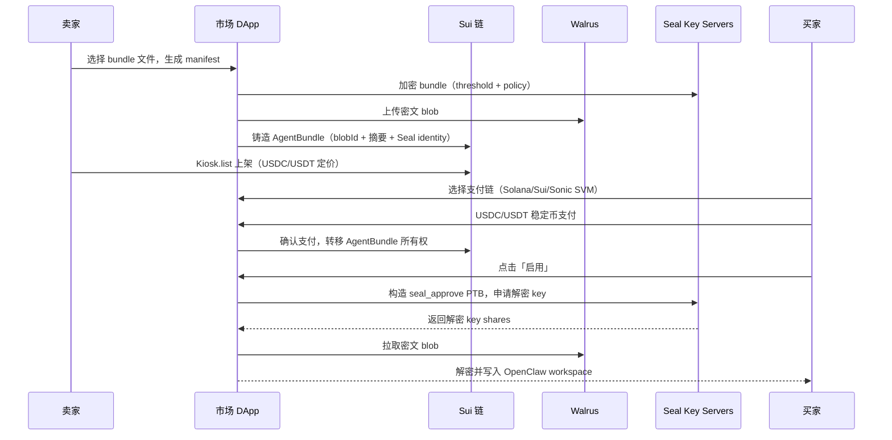

# CryptoOpenClaw 产品开发需求文档 (PRD)

> 历史 PRD，保留供追溯使用。当前仓库的 Souls、认证和市场语义以根目录 `SPEC.md` / `PLAN.md` 为准。

**版本**: v1.2
**日期**: 2026-03-09
**状态**: 进行中

---

## 一、产品定位

**一句话定位**：以加密新闻媒体为入口，以 OpenClaw 养成生态为核心，集 AI 辅助内容生产、应用方向检索、养成社区、交易市场于一体的平台。

**两阶段战略**：

| 阶段 | 目标 | 核心模块 | 状态 |
|------|------|----------|------|
| Phase 1 | 对外获客 | 新闻媒体 + AI 辅助内容生产 + 养成方向检索 | ✅ 已上线 |
| Phase 2 | 生态深耕 | 养成社区（✅ 已完成）+ 交易市场（未启动） | 🚧 进行中 |

**整体架构**：

```
┌──────────────────────────────────────────────────────┐
│                     Web 前端                          │
│  新闻首页 │ 方向检索 │ 社区 │ 知识库 │ Admin 后台      │
└───────────────────┬──────────────────────────────────┘
                    │
┌───────────────────┴──────────────────────────────────┐
│                    API 层                              │
│  新闻API │ 检索API │ 社区API │ 知识库API │ Admin API    │
└───────────────────┬──────────────────────────────────┘
                    │
┌───────────────────┴──────────────────────────────────┐
│            数据层 (Supabase / PostgreSQL)               │
│  Articles │ Categories │ Directions │ Members │ Posts  │
│  Knowledge │ Companies │ RawItems │ CollectorState     │
└───────────────────┬──────────────────────────────────┘
                    │
┌───────────────────┴──────────────────────────────────┐
│             后端引擎 (独立 Node 进程)                    │
│  数据采集 → AI 辅助内容生产 → 审核 → Telegram 分发      │
└──────────────────────────────────────────────────────┘
```

---

## 二、模块一 — 新闻媒体 + AI 辅助内容生产 ✅

### 核心概念

多源数据采集（RSS / GitHub / X）经过 AI 辅助处理后，生成中英文新闻内容，经审核后发布到 Web 站点和 Telegram 频道。

### AI 辅助内容生产流程

```
数据采集 → 去重/评分 → Reporter(摘要撰写) → Editor(质量审核) → Analyst(深度分析) → 发布
```

| 阶段 | 职责 | 说明 |
|------|------|------|
| 采集 | 多源数据自动采集 | RSS/GitHub/X 定时任务，存入 RawItem |
| Reporter | 摘要撰写、翻译 | 生成中文标题和导语 |
| Editor | 质量审核、终稿把关 | 审核润色内容 |
| Analyst | 深度解读、关联分析 | 添加分析评论 |
| 发布 | 多渠道分发 | 自动发布到 Telegram 频道 + Web |

> LLM 使用智谱 GLM-4.7，通过 OpenAI SDK 兼容接口调用。

### 用户故事

- 作为访客，我打开新闻首页可以看到最新的加密新闻列表
- 作为访客，我可以阅读新闻详情，包括中英文摘要和分析
- 作为管理员，我可以审核待发布内容，管理新闻发布流程

---

## 三、模块二 — 养成方向检索（类 DeFiLlama）✅

### 核心概念

OpenClaw 可以被用于各种场景（种番茄、养鱼、新闻媒体、交易分析等）。这个模块把所有养成方向分门别类，提供类似 DeFiLlama 的多维数据检索和排行。

### 分类体系

| 一级分类 | 示例二级分类 | 追踪指标 |
|---------|------------|---------|
| 🌱 农业养殖 | 种番茄、养鱼、种植规划 | 使用人数、成功率、评分 |
| 📰 内容媒体 | 新闻生产、自媒体、翻译 | 产出量、质量评分、订阅数 |
| 💹 交易金融 | 行情分析、策略回测、风控 | 收益率、使用人数、准确率 |
| 🎮 游戏娱乐 | NPC 对话、剧情生成、攻略 | 活跃度、好评率 |
| 🔧 开发工具 | 代码审查、文档生成、调试 | 使用频次、效率提升 |
| 📚 教育学习 | 语言学习、知识问答、辅导 | 学习时长、完成率 |

### 页面结构（已实现）

- **总览页** `/directions`：各方向的汇总数据卡片 + 分类导航 ✅
- **分类列表页** `/directions/[category]`：某个方向下所有具体应用，支持排序和筛选 ✅
- **详情页** `/directions/[category]/[slug]`：单个养成方向的详细介绍和数据 ✅

### 用户故事

- 作为访客，我可以浏览所有 OpenClaw 养成方向，按热度/分类筛选
- 作为用户，我可以查看某个方向的详细数据
- 作为用户，我可以提交新的养成方向供平台收录

### 待实现

- [ ] DirectionStat 方向统计数据模型（使用人数、评分趋势等）
- [ ] 数据趋势图

---

## 四、模块三 — 养成社区 ✅

### 核心概念

基于现有 TG 社群验证机制（已有 Member + InviteCode 模型），扩展为 Web 端养成社区。用户围绕自己的 OpenClaw 养成方向交流、分享经验、协作。

### 社区功能

| 功能 | 描述 | 状态 |
|------|------|------|
| 养成日志 | 用户发布自己的 OpenClaw 养成过程和心得，带方向标签 | ✅ 已实现 |
| 评论互动 | 用户可以评论他人的养成日志 | ✅ 已实现 |
| 个人主页 | 展示用户等级、成就、发布的日志 | ✅ 已实现 |
| 成就体系 | 养成里程碑徽章（首次养成、连续30天、达人认证等） | ✅ 模型已建立 |
| 方向讨论组 | 方向详情页内 Tab 形式聚合讨论区 | ✅ 已实现 |
| 排行榜 | 养成活跃度、贡献度排行 | ✅ 已实现 |
| 互助问答 | 用户提问，同方向的养成者回答，支持采纳 | ✅ 已实现 |

### 用户等级（沿用现有 Member.level）

| 等级 | 名称 | 条件 |
|------|------|------|
| Lv.1 | 🥚 孵化中 | 注册完成 |
| Lv.2 | 🦐 初蜕壳 | 首个养成方向启动 |
| Lv.3 | 🦞 成长期 | 3+ 养成日志、参与讨论 |
| Lv.4 | 🦞🦞 达人 | 某方向被评为优质、帮助他人 |
| Lv.5 | 🦞🦞🦞 导师 | 社区贡献突出、多方向经验 |

### 与 TG 社群的关系

Web 社区为主阵地，TG 群作为即时通知和轻量讨论的补充渠道，两端用户数据互通（通过 Member.tgId 关联）。

---

## 五、模块四 — 交易市场 📋

> **状态：已实现为 Soul Marketplace。** 以下设计文档为早期概念，实际实现已转向 Soul 模型。
>
> **当前架构**：单个 `Soul` 对象 + `SoulAsset` DB 镜像，所有权由 `currentKioskId/currentKioskCapOnChainId` 表示，allowlist 替代旧 grant，Walrus + Seal 负责内容访问。详见 `docs/legacy/plans/2026-03-26-soul-single-object-kiosk-rewrite.md`。
>
> 以下原始设计仅保留作为历史参考。

### 核心概念（已过时 — 实际实现为 Soul 模型）

两类交易并存：**AgentBundle 本体买卖**（MVP）+ 养成服务交易（远期）。以 USDC/USDT 等稳定币计价和结算，支持多链支付。

### 多链技术架构

```
┌─────────────────────────────────────────────────┐
│                  市场前端 (DApp)                   │
│    钱包连接 · 上架 · 购买 · 导入 · 我的交易         │
└────────────────────┬────────────────────────────┘
                     │
    ┌────────────────┼────────────────┐
    ▼                ▼                ▼
┌────────┐   ┌────────────┐   ┌──────────┐
│ Sui 层  │   │ 多链结算层   │   │ 存储层    │
│ 资产元数据│   │ USDC/USDT  │   │ Walrus   │
│ 访问控制 │   │ 支付确认    │   │ 加密内容  │
│ Seal策略 │   │            │   │ blob存储  │
└────────┘   └────────────┘   └──────────┘
```

| 层 | 职责 | 技术 |
|---|---|---|
| **Sui 资产层** | AgentBundle 对象铸造、元数据存储、Seal 访问控制策略 | Sui Move + Kiosk |
| **Walrus 存储层** | 加密 bundle 内容存储（密文 blob） | Walrus blob/quilt |
| **Seal 密钥层** | 按条件发放解密密钥（购买者才能解密） | Seal IBE + 阈值 key servers |
| **多链结算层** | USDC/USDT 稳定币支付与确认 | Solana / Sui / Sonic SVM |

**各结算链定位**：

| 链 | 定位 | 优势 |
|---|---|---|
| **Solana** | 主要结算链 | 生态用户基数大、gas 低、交易快 |
| **Sui** | 资产层 + 备选结算 | 资产存储与访问控制原生支持，同链结算最简 |
| **Sonic SVM** | 高性能结算 | Solana 上的高性能执行层，适合高频交易 |

### A. 本体交易 — AgentBundle

AgentBundle 是可版本化、可交易的 OpenClaw 配置包，按内容复杂度分为三层：

| 层级 | 名称 | 内容 | 风险等级 | 阶段 |
|------|------|------|---------|------|
| L1 | **模板类 (Template Bundle)** | workspace 文件（persona/规则/记忆模板） | 低 | **MVP 首选** |
| L2 | **增强类 (Enhanced Bundle)** | 模板 + 文档/知识库 | 低-中 | Beta |
| L3 | **可执行类 (Executable Bundle)** | 含 skills/Hook 脚本 | 高（需审核沙箱） | 远期 |

**资产上链流程**：

```
卖家打包 bundle → Seal 加密 → 上传 Walrus（密文 blob）
                                        ↓
Sui 链上铸造 AgentBundle 对象（存 blobId + manifest 摘要 + Seal identity）
                                        ↓
                              Kiosk 上架（USDC/USDT 定价）
```

**结算方式**：以 USDC/USDT 稳定币计价，买家可选择 Solana/Sui/Sonic SVM 任一链支付。Sui 上的 AgentBundle 对象作为权益凭证，购买确认后通过 Seal 获取解密密钥。

### B. 服务交易（远期规划）

> 按次/订阅/按时间段的服务交易**本阶段不纳入**，留作后续阶段。概念方向：用户可雇佣他人的 OpenClaw 执行具体任务（如"帮写一周新闻分析"），支持按次计费或订阅制。

### 交易机制（渐进式）

| 阶段 | 机制 | 说明 |
|------|------|------|
| MVP | 一口价 | Kiosk `list/purchase`，最快落地 |
| Beta | 二级市场 + 版税 | TransferPolicy 强制执行版税/手续费 |
| 扩展 | 拍卖 | Kiosk Extension 英式/荷兰拍卖 |

### 交易流程



### 安全与风控

| 风险 | 说明 | 缓解策略 |
|------|------|---------|
| 链上不保密 | Sui 对象内容可被外部读取 | 强制「先加密后存储」，链上仅存指针 + 摘要 |
| 恶意 bundle | 可执行类 bundle 含恶意脚本 | 沙箱执行、exec approvals、签名审核；MVP 仅开放模板类 |
| 内容泄露 | 买家解密后可复制传播 | 版税机制 + 水印追溯 + 订阅式访问（缓解而非杜绝） |
| Seal 可用性 | Key server 下线导致无法解密 | 合理阈值（t-out-of-n）、多 key server、信封加密 |
| 跨链结算延迟 | 多链支付确认时间差异 | 链上状态轮询 + 前端 waitForTransaction + 重试退避 |

### 分阶段路线图

| 阶段 | 目标 | 关键内容 |
|------|------|---------|
| **MVP** | 模板市场 | 一口价 USDC/USDT 结算，Template Bundle 上架/购买/导入 |
| **Beta** | 二级市场 | TransferPolicy 版税 + 成交索引 + 价格历史 |
| **扩展** | 高级交易 | 拍卖机制 + 多链结算完善 |
| **生态** | 可执行市场 | Executable Bundle 市场 + 审核/签名/信誉系统 |

### 待实现

- [ ] AgentBundle 打包规范与 manifest 标准
- [ ] Seal 加密 + Walrus 存储管线
- [ ] Move 合约：AgentBundle 对象 + seal_approve 策略
- [ ] 多链稳定币结算：Solana/Sui/Sonic SVM USDC/USDT 支付集成
- [ ] Kiosk 上架 + 多链钱包连接 + 稳定币支付前端
- [ ] OpenClaw 导入器（购买后写入 workspace）
- [ ] 市场页面（首页/列表/详情/我的交易）
- [ ] 信任机制（评价系统、链上可追溯）

---

## 六、模块五 — 知识库系统 ✅

### 核心概念

从采集的原始内容中提取有价值的知识条目，分类整理为可检索的知识库，服务于社区用户的学习和参考。

### 功能

| 功能 | 描述 |
|------|------|
| 知识条目管理 | 按分类（MCP / Mac / Windows / Linux / Prompt / Agent调试等）整理 |
| 内容类型 | 教程、踩坑记录、最佳实践、工具推荐 |
| 来源追踪 | 每条知识关联原始数据来源（RawItem） |
| 合并去重 | 相似内容可合并为一条 |
| 公共检索 | 支持按分类、类型、关键词搜索 |

### 页面

- `/knowledge` — 公共知识库浏览与搜索页面 ✅
- `/admin/tweets` — Admin 审核面板中包含知识库入库流程 ✅

---

## 七、模块六 — 数据采集与审核系统 ✅

### 核心概念

自动化多源数据采集 + 人工审核工作流，为内容生产和知识库提供原始素材。

### 采集源

| 来源 | 调度频率 | 说明 |
|------|---------|------|
| RSS | 每小时整点 | 订阅的 RSS 源自动采集 |
| GitHub | 每日 06:00 | 热门仓库和版本发布追踪 |
| X (Twitter) | 每 30 分钟 | 通过外部数据库集成，关键词过滤 + 互动评分 |
| Telegram /mark | 手动触发 | 管理员在群内标记消息为素材 |

### 处理流程

```
采集 → 去重(SimHash) → 评分 → [短内容→人工审核] → AI 生产 → 自动发布
                                [长内容→直接处理]
```

### 审核工作台

- `/admin/tweets` — Tweet 内容审核（批准/拒绝/入库知识库）✅
- `/admin/articles/[id]` — 文章编辑与审核 ✅

### 辅助功能

- **CollectorState** — 采集进度追踪（记录每个源的最后采集位置）✅
- **Company 管理** — 公司/项目数据库，Admin CRUD ✅
- **手动提交** — `/admin/submit` 管理员手动提交内容 ✅

---

## 八、Telegram Bot ✅

### 功能

| 命令/功能 | 描述 |
|----------|------|
| `/start` | 显示帮助菜单；深度链接 `/start join` 触发入群流程 |
| `/join` | 生成邀请码（10 分钟有效期） |
| `/mark` | 管理员在群内标记消息为采集素材 |
| `/chatid` | 调试：显示当前聊天 ID |
| 欢迎消息 | 新成员加入群聊时自动发送欢迎消息 |
| 自动发布 | 每 5 分钟自动发布待发文章到频道 |

Bot 基于 Grammy 框架，支持长轮询模式。

---

## 九、数据模型

基于 Prisma ORM，当前共 18 个模型。

### 模型清单

| 模型 | 用途 | 状态 |
|------|------|------|
| **RawItem** | 原始采集数据（RSS/GitHub/X/社区） | ✅ |
| **CollectorState** | 采集进度追踪（每个源的最后位置） | ✅ |
| **Article** | 处理后的新闻文章（中英文标题/摘要/分析） | ✅ |
| **AgentRole** | 内容生产角色定义（reporter/editor/analyst） | ✅ |
| **AgentProcessLog** | 文章经过每个角色的处理记录 | ✅ |
| **Company** | 公司/项目数据库（logo/分类/提及次数） | ✅ |
| **ArticleCompany** | 文章与公司的关联（多对多） | ✅ |
| **Publication** | 分发记录（频道/消息ID/发布时间） | ✅ |
| **Member** | 社区成员（TG绑定/等级/经验值/邀请码） | ✅ |
| **InviteCode** | 注册邀请码（过期时间/使用者） | ✅ |
| **Category** | 养成方向一级分类 | ✅ |
| **Direction** | 具体养成方向（slug/评分/用户数） | ✅ |
| **Post** | 社区养成日志 | ✅ |
| **Comment** | 日志评论 | ✅ |
| **Achievement** | 成就徽章定义 | ✅ |
| **MemberAchievement** | 用户获得的成就记录 | ✅ |
| **KnowledgeEntry** | 知识库条目（分类/内容类型/合并追踪） | ✅ |
| **KnowledgeEntrySource** | 知识条目与原始数据的关联 | ✅ |

### 关键关联

```
Member  1:N  Post（发养成日志）
Member  1:N  Comment（发评论）
Member  1:N  MemberAchievement（获得成就）
Direction  1:N  Post（日志归属方向）
Article  1:N  AgentProcessLog（新闻处理记录）
AgentRole  1:N  AgentProcessLog（哪个角色处理的）
Category  1:N  Direction（分类包含方向）
KnowledgeEntry  1:N  KnowledgeEntrySource（知识来源）
RawItem  1:N  KnowledgeEntrySource（原始数据关联）
```

### 待新增模型（交易市场启动时）

```
AgentBundle        — 链上资产对象（Sui Move），存 blobId/manifest 摘要/Seal identity
WalletBinding      — 用户钱包绑定（地址/链类型/关联 Member）
Listing            — 交易挂单（关联 AgentBundle，USDC/USDT 定价）
Order              — 交易订单（支付链/币种/状态/交易哈希）
Review             — 交易评价
DirectionStat      — 方向统计数据（使用人数、评分趋势）
```

---

## 十、页面清单与路由

### 公共页面

| 页面 | 路由 | 功能 | 状态 |
|------|------|------|------|
| 新闻首页 | `/` | 最新新闻列表、标签筛选 | ✅ |
| 新闻详情 | `/news/[id]` | 全文 + 中英文摘要 + 分析 | ✅ |
| 方向总览 | `/directions` | 养成方向分类卡片 + 导航 | ✅ |
| 方向分类页 | `/directions/[category]` | 某分类下方向列表，排序筛选 | ✅ |
| 方向详情 | `/directions/[category]/[slug]` | 方向数据 + 讨论/问答 Tab | ✅ |
| 社区首页 | `/community` | 日志/问答流 + 类型筛选 | ✅ |
| 发布帖子 | `/community/new` | 日志/问答编辑器，方向标签 | ✅ |
| 帖子详情 | `/community/[id]` | 帖子内容 + 评论 + 问答采纳 | ✅ |
| 排行榜 | `/community/leaderboard` | 活跃度/贡献度排行 | ✅ |
| 个人主页 | `/u/[id]` | 养成等级、成就、日志 | ✅ |
| 知识库 | `/knowledge` | 知识条目浏览与搜索 | ✅ |
| 技能目录 | `/skills` | OpenClaw 技能卡片列表，每日同步 GitHub | ✅ |
| 登录 | `/login` | Supabase Auth 认证 | ✅ |
| 验证 | `/verify` | 邮箱/凭证验证 | ✅ |

### Admin 页面

| 页面 | 路由 | 功能 | 状态 |
|------|------|------|------|
| 管理后台 | `/admin` | 仪表盘 | ✅ |
| 文章编辑 | `/admin/articles/[id]` | 编辑/审核文章 | ✅ |
| Tweet 审核 | `/admin/tweets` | 内容审核 + 知识库入库 | ✅ |
| 成员管理 | `/admin/members` | 成员列表管理 | ✅ |
| 公司管理 | `/admin/companies` | 公司/项目 CRUD | ✅ |
| 方向管理 | `/admin/directions` | 养成方向管理 | ✅ |
| 邀请码管理 | `/admin/invites` | 邀请码管理 | ✅ |
| 手动提交 | `/admin/submit` | 手动提交内容 | ✅ |

### 待实现页面

| 页面 | 路由 | 功能 | 优先级 |
|------|------|------|--------|
| 市场首页 | `/market` | 热门本体 + 服务 + 分类导航 | P3 |
| 本体列表 | `/market/claw` | 筛选、排序、搜索 | P3 |
| 服务列表 | `/market/services` | 按方向分类、评分排序 | P3 |
| 交易详情 | `/market/[id]` | 详细信息 + 评价 + 购买 | P3 |
| 我的交易 | `/market/my` | 订单管理、挂单管理、收入 | P3 |

---

## 十一、后续排期

| 阶段 | 内容 | 优先级 |
|------|------|--------|
| ~~社区增强~~ | ~~方向讨论组、排行榜、互助问答~~ | ✅ 已完成 |
| 数据统计 | DirectionStat 模型、方向趋势图 | P2 |
| 交易市场 MVP | AgentBundle 打包规范 + Seal/Walrus 管线 + 模板一口价市场 | P3 |
| 交易市场 Beta | 二级市场 + TransferPolicy 版税 + 成交索引 | P3 |
| 交易市场扩展 | 拍卖机制 + 多链（Solana/Sui/Sonic SVM）结算完善 | P4 |
| 交易市场生态 | 可执行类 bundle 市场 + 审核/签名/信誉系统 | P4 |
| 多链钱包集成 | 多链钱包连接（Solana/Sui）+ WalletBinding + 稳定币支付 | P3 |

---

## 十二、技术栈

| 层 | 技术 | 版本/备注 |
|----|------|----------|
| 前端 | Next.js + React + TailwindCSS | Next.js 16 / React 19 / Tailwind CSS 4 |
| 后端 | Node.js + TypeScript | ES Modules, TypeScript 5.7 |
| 数据库 | PostgreSQL (Supabase) + Prisma ORM | Prisma 7.4.2 + @prisma/adapter-pg |
| 认证 | Supabase Auth | @supabase/supabase-js 2.x + @supabase/ssr |
| AI 引擎 | 智谱 GLM-4.7（主力） | 通过 OpenAI SDK 兼容接口调用 |
| 消息 | Telegram Bot (Grammy) | Grammy 1.30+ |
| 部署 | Vercel（全栈）+ 独立 Node 进程（后端引擎） | — |
| 测试 | Vitest | Vitest 3.0 |

### 设计风格

"Midnight Chronicle" — 暗色主题 glassmorphism 设计。

---

## 十三、风险与依赖

| 风险 | 影响 | 缓解 |
|------|------|------|
| Seal key server 可用性 | 用户无法解密已购买的 bundle | 合理阈值（t-out-of-n）+ 多 key server + 信封加密便于轮换 |
| 跨链桥安全 | 多链结算资金安全风险 | 优先使用原生稳定币转账，避免依赖第三方桥；逐步验证 |
| 多链结算延迟 | 不同链确认时间差异影响 UX | 前端状态轮询 + waitForTransaction + 重试退避 |
| 恶意 bundle 供应链 | 可执行类 bundle 含恶意脚本 | MVP 仅开放模板类；可执行类需沙箱 + exec approvals + 审核 |
| 养成方向冷启动 | 初期无用户数据，排行榜空 | 运营预填方向 + 示例数据（种子脚本已就绪） |
| 内容泄露不可逆 | 买家解密后复制传播 | 版税机制 + 水印 + 订阅式访问（缓解而非杜绝） |
| X 数据源稳定性 | 外部数据库依赖，可能中断 | 多源采集互补，RSS/GitHub 独立运行 |
