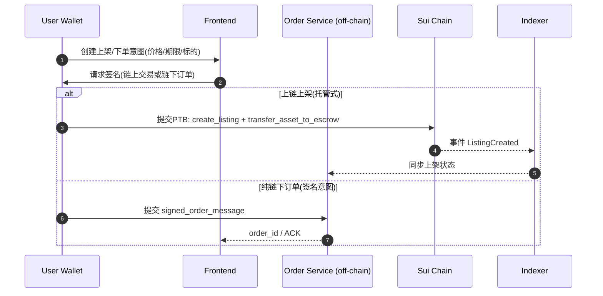
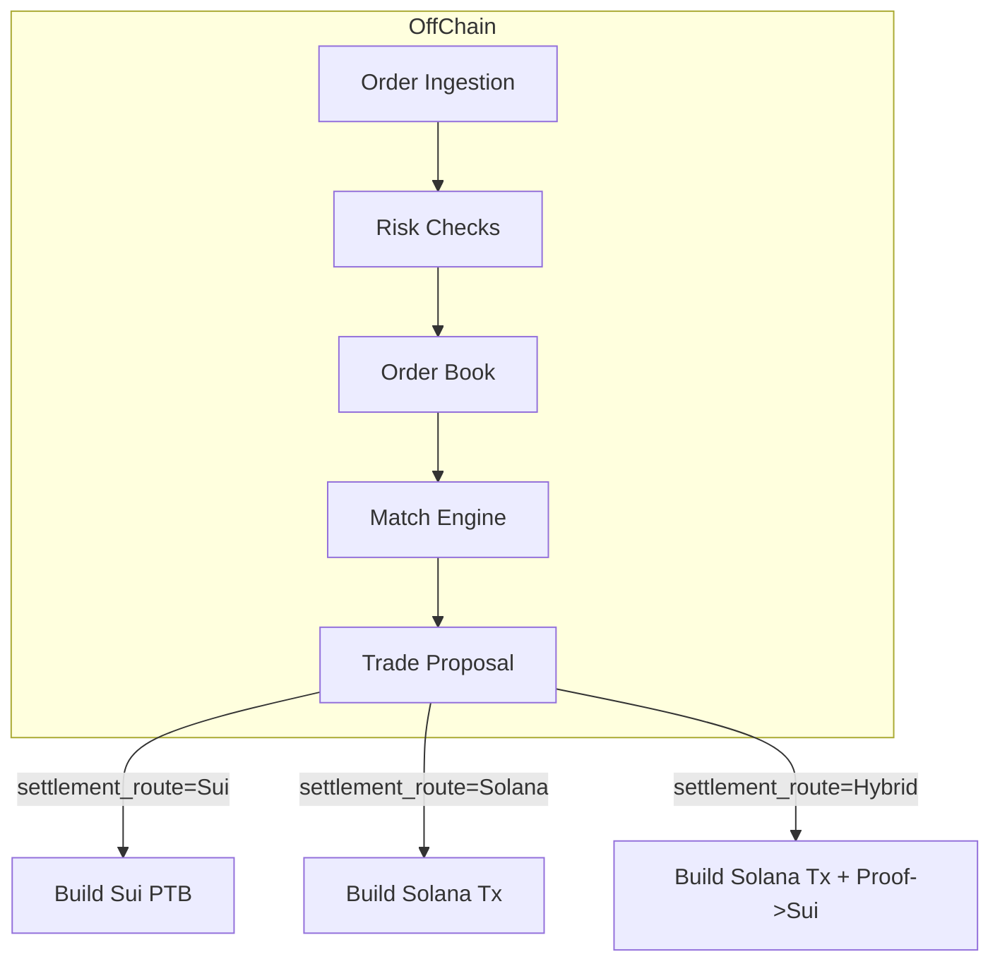
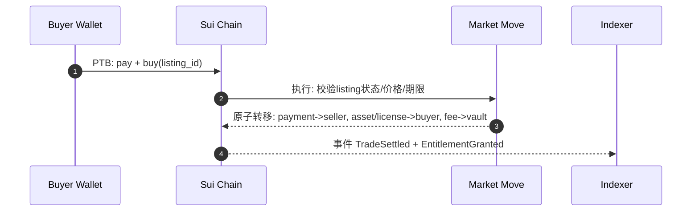
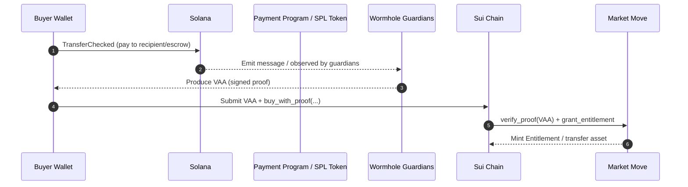

# 基于 Sui 与 Solana 结算、Walrus 与 Seal 存储的交易市场模块技术实现方案

> **文档状态**
> 本文档是未来阶段（post-MVP）的技术备选方案，用于评估跨链支付、Walrus/Seal 存储与自定义链上状态机的演进方向。
>
> 当前仓库已经接受并进入实施的 MVP 基线以以下文档为准：
> - [docs/plans/2026-03-12-marketplace-mvp-design.md](./plans/2026-03-12-marketplace-mvp-design.md)
> - [docs/plans/2026-03-12-implementation-plan.md](./plans/2026-03-12-implementation-plan.md)
>
> 若本文与上述 MVP 文档存在冲突，一律以 MVP 文档为准。不要将本文作为当前版本的直接实施说明。

## 执行摘要

**定位说明：** 本报告描述的是未来阶段可考虑的扩展架构，不是当前 `clawnews` 仓库已确认执行的 MVP 方案。当前 MVP 采用 **Sui-only 支付 + Supabase Storage + Supabase/Postgres 作为业务真相源 + 无自定义 Move 合约** 的实现路径；本文仅用于后续阶段评估何时引入 Solana、Walrus、Seal 或链上撮合/结算能力。

本报告提出一套面向“交易市场（模块四）”的技术实现方案：以 **Sui** 作为“资产与权限的权威链”（承载资产所有权、交易状态、授权策略与可验证事件），以 **Solana** 作为“可选支付结算轨道”（承载 SOL/SPL 资产支付与高吞吐支付确认），并将大体量数据与可验证持久化交给 **Walrus**，将“数据在公开存储上的机密性与可编程访问控制”交给 **Seal**（其访问控制策略由 Sui 上的 Move 合约定义并由 Seal Key Server 在链下执行验证）。Walrus 将 blob 与 Sui 对象绑定、通过事件提供可验证可用性证明；Seal 通过阈值门限（t-of-n）密钥服务器与会话密钥机制，提供“客户端加密 + 链上策略控制解密份额”的 DSM（去中心化秘密管理）能力。citeturn2view2turn7view0turn3view0turn16view0turn1view1turn18view1

核心结论是：若交易市场的“可交易标的”包含内容类资产（图片/模型/文档/AI 产物等），则 **把“内容/元数据”放在 Walrus、把“解密授权”放在 Seal（策略在 Sui）** 能显著降低链上存储与隐私风险；而“支付结算”可根据业务侧对币种生态与吞吐的偏好，选择 **Sui-only、Solana-only（支付）、或混合（Solana 支付 + Sui 授权/交付）**。在混合模式下，建议采用具备可验证消息/证明的跨链机制（例如 Wormhole VAA 作为带守护者签名的消息证明）把 Solana 支付结果安全地带到 Sui 链上完成交付，避免单点托管式“中心化撮合/结算人”风险。citeturn29search0turn29search4turn29search35turn16view0

本方案给出：系统架构、组件职责、数据模型、链上/链下边界、交易与结算生命周期、Walrus/Seal 的 API 与数据格式、Sui Move 与 Solana Program 的接口/事件/权限控制、费用模型、并发与回滚（reorg）处理、威胁模型与缓解、测试与运维、以及工作量/成本区间估算（基于假设）。citeturn15view5turn12view2turn15view2turn12view1turn7view0turn18view1

## 需求范围与假设

由于对话中提到“附件模块四——交易市场”，但当前会话无法通过检索型文件工具访问到该附件内容（因此无法基于附件逐条对齐需求），本报告将以公开可验证的一手资料与必要工程假设给出一份未来阶段架构蓝图，并在关键处标注“未指定项/假设项”。本文不替代当前 MVP 设计文档，仅用于后续阶段方案评估。citeturn16view0

**未指定关键约束（需显式确认，以下作为假设）：**  
交易市场的目标吞吐（TPS）、撮合延迟目标（P95/P99）、支持的订单类型（市价/限价/拍卖/批量）、资产类型（NFT/FT/内容访问权/衍生品）、托管模型（链上托管/半托管/纯签名意图）、是否需要 KYC/合规与风控、法币出入金、是否需要 MEV/抢跑防护、是否允许中心化撮合。citeturn15view0turn15view4turn12view2turn16view0

**关键设计假设（为可实现性与一致性）：**  
1) “内容/大文件/元数据”走 Walrus（blob 存储），链上仅保存引用（blobId / Sui objectId）与校验值；2) 任何敏感内容必须先在客户端加密，再写入 Walrus（Walrus 默认公开可发现）；3) 内容访问控制以 Seal 为主，其策略函数 `seal_approve*` 部署在 Sui 上；4) 交易市场至少包含“上架/下架/购买/结算/交付（解密授权）”闭环；5) 结算币种可包含 Sui 原生币（SUI）与 Solana 侧 SPL Token（如稳定币），且需要可验证的“支付完成证明”以触发交付。citeturn6search1turn3view0turn16view1turn12view2turn30search4

## 系统架构与职责分工

总体采用“链上确定性状态机（资产/授权/结算最终状态） + 链下高性能服务（撮合/索引/存储网关/跨链提交）”的分层架构：Sui 与 Solana 分别承担其擅长的状态与结算路径；Walrus 与 Seal 提供“可验证数据层 + 可编程机密性层”。citeturn24view1turn15view5turn12view2turn7view0turn16view0

**链上边界（On-chain）：**  
- Sui：资产对象（NFT/凭证/订单状态对象）、市场配置与费率、交易事件（可被索引）、Seal 授权策略合约、与 Walrus blob 对象/事件的关联验证（blob 可用性证明基于 Sui 事件）。Sui 交易最终性依赖“交易证书 + 2/3 验证者最终确认”，并且会对等价性（equivocation）导致的对象锁定提供语义约束，因此特别适合承载“最终状态与可审计事件”。citeturn15view5turn14search3turn15view4turn7view0  
- Solana：支付轨道（SOL/SPL Token 转账与可选托管 escrow）、支付确认与过期处理（blockhash 过期机制），以及必要的支付侧事件/日志以供证明与索引。Solana 的承诺级别（processed/confirmed/finalized）与交易过期（recent blockhash）决定了“何时可以视为结算成功”。citeturn12view0turn12view2turn15view0turn30search4

**链下边界（Off-chain）：**  
- 撮合与订单管理：高吞吐订单簿、撮合、风控、报价、撮合证明/审计日志；  
- 索引与数据服务：订阅 Sui 事件与 Solana RPC，生成可查询的市场视图；  
- 存储网关：将文件（密文）上传 Walrus（可通过 Publisher / Upload Relay / SDK），管理 blob 生命周期；  
- Seal Key Server 选择与运维：选择独立/委员会式 key server，建立阈值配置与 SLA；  
- 跨链证明提交：将 Solana 支付结果以可验证消息形式提交到 Sui（或反向），实现“支付→交付”的最小信任闭环。citeturn7view0turn19search6turn16view1turn18view4turn29search0

### 设计选项对比表

| 方案 | 结算权威链 | 资产/授权权威链 | Walrus/Seal 依赖 | 优点 | 主要风险/代价 | 适用场景 |
|---|---|---|---|---|---|---|
| Sui-only | Sui | Sui | 原生对齐（Walrus/Seal 与 Sui 紧密集成）citeturn2view2turn7view0turn16view0 | 单链原子性最好；与 Seal 策略同链；Sui PTB 支持原子组合与批处理citeturn15view3turn15view5 | 币种生态受限；若要承载高频撮合需谨慎处理 shared object 争用与对象版本citeturn15view4turn1view2 | 内容/NFT 市场、链上交付与授权为核心 |
| Solana-only（支付） | Solana | 仍需 Sui（仅用于 Seal 策略/授权）citeturn16view0turn16view1 | Walrus/Seal 强依赖 Sui 作为策略验证/对象绑定citeturn7view0turn16view0 | 支付体验好（SPL 生态）；高吞吐支付citeturn15view0turn12view1turn30search4 | 交付需跨链证明；处理确认/过期/重试复杂citeturn12view0turn11search31turn12view2 | 以支付为主、交付在 Sui 侧实现 |
| 混合（推荐） | Solana（支付）+ Sui（交付/授权） | Sui | Walrus/Seal 与 Sui 对齐citeturn7view0turn29search35turn16view0 | 兼顾 Solana 支付生态与 Sui 资产/授权一致性；可用 VAA 等证明降低信任citeturn29search0turn29search4turn29search8 | 引入跨链消息成本与攻击面；需要严格最终性门槛与重放保护citeturn12view2turn29search0turn15view4 | 内容市场、订阅/许可、跨生态支付 |

## 数据模型与智能合约设计

本节以“内容类资产交易市场”为基准：用户交易的不是把大文件上链，而是交易“内容资产（NFT/许可凭证） + 可验证内容引用 + Seal 授权策略命名空间”。Walrus 存 blob（密文），Sui 链上对象存引用与状态，Seal 控制解密份额。citeturn7view0turn6search1turn16view1

### 统一业务数据模型（链下主模型，链上做子集映射）

建议链下数据库（Postgres/分布式 KV）维护以下表/集合，并由链上事件驱动更新最终态（event-sourced view）：  
- `Asset`：`asset_id`、`issuer`、`walrus_blob_id`、`walrus_blob_object_id`、`content_hash`、`seal_policy_package_id`、`seal_policy_id`、`metadata_schema_version`；  
- `Listing/Order`：`order_id`、`maker`、`side`、`price`、`currency`（SUI 或某 SPL mint）、`quantity`、`expiry`、`settlement_route`（Sui/Solana/Hybrid）、`status`；  
- `Trade`：`trade_id`、`order_id(s)`、`fill`、`fees`、`state_machine`（Created→Paid/Locked→Delivered/Settled→Finalized）；  
- `Entitlement`：`entitlement_id`、`buyer`、`asset_id`、`policy_ref`（Seal ID）、`valid_from/to`、`revocable`、`proof`（链上对象/事件指针）。citeturn11search6turn11search2turn16view1turn7view0

链上仅保留“最终可信子集”：订单状态（或成交状态）、资产所有权/许可对象、费用分配状态、以及可被轻客户端验证的事件（必要时用 `emit_authenticated`）。citeturn11search2turn15view5turn24view0

### Sui Move 合约设计（接口、事件、权限控制）

Sui 的对象模型与版本控制要求：每个对象通过 `(ObjectId, SequenceNumber)` 唯一定位，重复并发使用同一 owned 对象版本会触发 equivocation，并可能导致对象锁定直到 epoch 结束；因此市场合约应尽量避免“全局单一 shared 热点对象”，倾向于“分区/分片的共享对象 + 多 owned 对象”，并通过 PTB 原子组合完成复杂结算。citeturn15view4turn15view3turn20search2

**推荐合约分层：**  
- `market::config`：市场参数、费率、白名单（支付币种/允许的 Seal policy 包）、升级策略与管理员能力（AdminCap）；  
- `market::asset`：内容资产/许可凭证（NFT 或可组合对象），保存 Walrus/Seal 引用（仅引用，不直接存密文）；  
- `market::trade`：上架/购买/取消/结算的状态机与事件；  
- `market::settlement`：Sui-only 结算（Sui Coin/Token 转移 + 资产转移/许可铸造），以及混合结算的“证明验证入口”（例如验证 Wormhole VAA 或其他跨链证明后再交付）。citeturn15view3turn15view5turn29search0turn29search8

**核心对象（示意）：**
```move
module market::types {
    use sui::object::UID;

    /// 市场配置：建议做 shared object，但尽量只读；更新走治理/低频入口
    public struct MarketConfig has key, store {
        id: UID,
        admin: address,
        fee_bps: u16,
        // 可扩展字段用 dynamic fields 降低结构变更成本
        // 例如: allowed_currencies, fee_vault, pausable, ...
    }

    /// 上架单：建议为 address-owned（卖家持有），成交时原子转移到合约销毁/归档
    public struct Listing has key, store {
        id: UID,
        seller: address,
        asset_object_id: address, // 被卖资产对象ID（或许可模板ID）
        price: u64,
        // currency_type 通过 TypeName / struct tag 间接表达（示意）
        expiry_epoch: u64,
        status: u8, // 0=Active,1=Cancelled,2=Sold
    }

    /// 买家权限/许可：买到的是“可解密权利”时，可铸造许可对象
    public struct Entitlement has key, store {
        id: UID,
        owner: address,
        asset_object_id: address,
        seal_policy_id: vector<u8>, // 与 seal_approve* 的 id 对应（不含 package 前缀）
        valid_until_epoch: u64,
    }
}
```
上述“动态扩展字段”可用 Sui 动态字段/动态对象字段实现，动态字段按访问计费、可存异构值，适合维护可变集合（白名单、索引）。citeturn20search2turn20search10

**事件设计：**  
Sui 事件是索引器跟踪链上行为的主手段，且 `emit_authenticated` 允许发出可被轻客户端认证的事件流（仅定义该事件类型的 package 能发出认证事件）。citeturn11search6turn11search2turn24view0  
建议事件至少包括：`ListingCreated`、`ListingCancelled`、`PaymentLocked`、`TradeSettled`、`EntitlementGranted`、`RoyaltyPaid`（如有）。citeturn11search6turn11search2

**权限控制：**  
- 管理员权限用 `AdminCap`（address-owned）或自定义升级策略保护 `UpgradeCap`，避免单私钥升级风险；Sui 支持自定义升级策略（UpgradeTicket/Receipt）与 `make_immutable` 等机制。citeturn30search3turn30search39turn30search11  
- 对“可暂停/风控参数变更/费用提取”等敏感入口，建议加 timelock 或多签治理（具体实现取决于业务治理约束）。citeturn30search39turn15view4

### Solana Program 设计（接口、账户模型、事件）

若 Solana 仅作为“支付轨道”，最简实现是：买家直接调用 SPL Token `TransferChecked` 把款项打给卖家（或支付托管账户），链下与/或跨链证明系统再把支付结果带到 Sui 完成交付；`TransferChecked` 是官方代币转移的基础指令，要求源账户 owner/delegate 授权。citeturn30search4turn12view0turn11search31

若需要“支付托管（escrow）”以实现更强的公平性（例如先锁款、再凭 Sui 交付证明放款），建议使用 **Anchor** 开发一个最小 escrow 程序：Anchor 提供程序结构、账户约束与 IDL，简化测试/部署/交互并降低常见错误。citeturn30search1turn30search9turn30search5

**Solana 侧关键工程约束：**  
- 交易消息包含账户列表、指令列表与 recent blockhash；交易需在 blockhash 有效期内上链，否则过期；并且处理确认要以 commitment（confirmed/finalized）门槛决定业务动作（发货/交付）。citeturn12view0turn12view2turn15view1  
- Solana 交易有 size limit（最大 1,232 bytes）与账户/指令数量等限制，因此不适合塞入大型订单/元数据，应该用“链下订单 + 链上引用（hash/ID）”。citeturn15view0turn12view0

## 交易生命周期与结算方案

交易市场的业务状态机建议以“最终确定状态”为核心：订单/成交一旦进入“Finalized/Delivered”，就应该在 Sui 上可证明、可索引、可追溯；而中间过程（撮合、报价、风控）可链下完成并写入审计日志（可选写入 Walrus 作为可验证审计轨迹）。Walrus 适用于“高风险系统审计轨迹/市场基础设施日志”等场景，并提供可验证性与高可用。citeturn2view2turn7view0

### 关键流程一：下单与上架（Order Placement / Listing）



Sui 侧建议优先采用“上链上架（托管式）”用于 NFT/许可的现货交易：它能把“是否可成交”变成链上可验证事实，减少签名重放与链下订单守护成本，但代价是上架需要链上交易与费用。Sui 的 PTB 支持把多条命令原子组合、若其中任何一步失败则整笔失败，不产生部分效果。citeturn15view3turn15view5

链下签名意图模式适用于高频订单簿，但需要在链上实现“防重放/防重复成交”的状态（通常会引入 shared 状态与争用），并额外处理签名域分离与撤单语义；因此除非吞吐/延迟目标明确要求，建议作为二期能力。citeturn15view4turn12view2turn15view0

### 关键流程二：撮合（Matching）



撮合引擎（Match Engine）链下化的优势在于：避免 shared state 热点导致的链上并发瓶颈，并可实现更复杂的风控与撮合策略；链上只负责“最终结算与交付”。在 Sui 上，shared 对象与 owned 对象走不同路径（fast path vs 共识路径），同一对象版本的并发使用会触发锁定风险，因此“把撮合留在链下、把结算留在链上”通常更稳健。citeturn1view2turn15view4turn24view1

### 关键流程三：Sui-only 结算（原子交割）



Sui-only 的关键是“一笔交易内原子完成”：支付币（Coin）可通过 PTB 中的 `splitCoins/mergeCoins` 等操作完成精确付款与找零，随后在同一 PTB 内做对象转移；PTB 的命令序列在一个交易块里按序执行并在末端原子提交。citeturn15view3turn30search6turn15view5

Sui 的 gas 模型将费用拆为计算费与存储费，并在删除对象时提供存储费返还（rebate），因此合约应尽量在交易完成后清理临时对象（如已成交 listing）以降低净费用；净费用关系为 `net = computation + storage - rebate`。citeturn15view2turn15view5

### 关键流程四：混合结算（Solana 支付 + Sui 交付/授权）

混合结算的关键问题是“跨链原子性”：支付发生在 Solana，但交付/授权发生在 Sui（Seal policy 在 Sui），因此必须有一个 **可验证、可重放防护、具备最终性门槛** 的跨链证明把“支付已完成”带到 Sui。Wormhole 的 VAA 是一种典型的跨链消息证明：消息由 Guardian 网络验证并由超 2/3 的 Guardian 签名后形成 VAA；VAA 可由任何人提交到目标链合约，且因包含签名与目标信息而难以伪造。citeturn29search0turn29search4turn29search8



**最终性与重放防护建议：**  
- Solana 支付证明必须要求 `confirmed` 或更高（关键交付建议 `finalized`），因为 `processed` 可能在分叉中被丢弃；并且要处理交易过期与重试：在 blockhash 未过期前重发可能造成双花/重复支付风险，因此应等待过期或查询到明确失败再重试。citeturn12view2turn11search15turn11search31turn12view0  
- Sui 侧应维护“已消费的证明（nonce/txid/message_id）集合”，防止同一支付证明被重放再次领取交付；该集合应设计为低争用结构（分片 dynamic fields 或按 buyer 分桶）。citeturn20search2turn20search10turn15view4

## Walrus 与 Seal 存储与加密集成

### Walrus：数据对象、证明与 API

Walrus 的核心特性是：blob 内容寻址（content-addressed），同一内容产生同一 blob ID；写入后同时获得 `Blob ID` 与对应的 `Sui object ID`，前者用于读取内容、后者用于管理 blob 元数据（例如延长存储周期）。存储以 epoch 为单位，Testnet epoch 为 1 天、Mainnet epoch 为 2 周（文档示例）。citeturn3view0turn7view0

Walrus 通过 RedStuff 纠删码与证书机制提供可用性与可验证性：上传时 blob 被编码成 slivers，收集存储节点签名收据并聚合成可用性证书；当 blob 被认证（certified）会产生 `BlobCertified` 事件，其轻客户端证明可作为“该 blob 可用”的证明。读取时客户端/聚合器获取元数据与签名，向存储节点请求足量 slivers 并验证后重构原文。citeturn7view0turn7view1turn22view0turn22view1

**HTTP 写入（Publisher）与返回格式：**  
Walrus 支持通过 HTTP PUT 向 publisher 写入 `/v1/blobs`，可用 query params 指定 `epochs`、`permanent/deletable`、`send_object_to` 等；成功时返回 JSON（包含 blobObject.id、blobId、encodingType、storage.start/endEpoch、cost 等）。citeturn4view0  
此外，存储节点/聚合器/发布者按设计提供 OpenAPI 规范端点 `/v1/api`（用于集成与自建服务）。citeturn6search6turn7view2

**大文件与 Upload Relay：**  
浏览器/移动端直接与所有存储节点并发交互成本高，Walrus 提供 Upload Relay：客户端先在 Sui 上注册 blob（并可在同一 PTB 内附带给 relay 的 tip 支付），再向 relay 的 `/v1/blob-upload-relay` POST 原始数据，relay 负责分发 slivers 并回传 confirmation certificate，客户端再用该证书在 Sui 上 certify blob。tip 机制要求用 PTB 支付，并把 `blob_digest||nonce_digest||unencoded_length` 的 BCS 编码作为 PTB 输入用于认证请求。citeturn19search6turn15view3

**Walrus SDK（TypeScript）集成：**  
TS SDK 提供批量 `getFiles` 读取与 `writeFiles` 写入，并要求 Signer 同时具备足够 SUI（链上操作与 gas）与 WAL（存储支付）。建议尽量批量读取以提升效率。citeturn7view3turn7view0turn3view0

### Seal：加密、授权策略、会话密钥与阈值证明

Seal 是去中心化秘密管理（DSM）服务：数据在客户端加密，解密份额由链下 key server 在验证 Sui 上的访问控制策略后发放；策略以 Move 包的 `seal_approve*` 函数表达，并由 key server 通过 `dry_run_transaction_block` 在全节点本地状态上评估。Seal 支持 t-of-n 阈值加密：不同组织运行 key server，用户选择阈值以平衡可用性与信任分散。citeturn16view0turn16view1turn18view4

**策略函数约束（`seal_approve*`）：**  
- 首参必须是“请求 identity（不含 packageId 前缀）”；  
- 不授予访问则 abort；  
- 必须无副作用（不能改链上状态）；  
- 由于全节点异步与 dry-run 的非全局原子性，不宜依赖快速变化状态或依赖 checkpoint 内相对顺序的不变量。citeturn16view1turn17view3turn15view4

**客户端加密接口与 envelope encryption：**  
Seal SDK `encrypt` 需要：阈值、策略包 packageId、policy id、数据；返回 `encryptedObject`（BCS 序列化密文对象字节）与对称密钥 `key`（可作为灾备或手动解密用）。Seal 明确指出加密不隐藏消息长度，若长度敏感需 padding；并推荐 envelope encryption：用随机对称密钥加密大内容、再用 Seal 加密该对称密钥，从而允许在 Walrus 上不可变存储密文内容、同时在 Sui 上单独管理密钥与访问策略（便于旋转 key server 或升级策略而无需改 Walrus 内容）。citeturn17view3turn16view1turn28view0turn28view1

**会话密钥与解密流程：**  
Seal 解密通常通过 `SessionKey`：用户在钱包中签名一次以批准某 package 的短期访问（TTL），之后可在 TTL 内多次获取解密份额而无需再次确认。解密调用要求提供仅包含 `seal_approve*` 调用的交易字节（`txBytes`），并强调 key server 会缓存/复用以优化性能；若 key server 因未索引到最新链上对象而返回 `InvalidParameter`，需要等待同步后重试。citeturn17view0turn18view1turn18view1

**链上解密（可选，高级能力）：**  
Seal 支持在 Move 中进行 HMAC-CTR 形式的链上解密（通过 `seal::bf_mac_encryption` 包），用于拍卖/投票/可验证工作流等；流程包括：链上存 key server 公钥、用 SDK 获取 derived keys 并在链上验证，最后解密得到 `Option<vector<u8>>`。文档给出了测试网/主网 Seal packageId 示例。citeturn18view2turn18view3

**加密原语与安全基线（与交易市场关系）：**  
Seal 的设计目标是将访问控制与阈值门限交给链上策略与分布式 key server，底层采用基于配对的 IBE（学术起源可追溯到 Boneh-Franklin IBE）与现代 AEAD（如 AES-GCM）建立“密钥封装/数据封装（KEM/DEM）”模式，这是实现“身份/策略驱动密钥派生 + 客户端加密”的常见构造基础。citeturn27view2turn28view0turn1view1

## 费用、并发、可靠性与安全、测试与运维成本

### Gas/费用与成本敏感点

**Sui：**  
- 费用由计算费与存储费构成；存储单位当前线性映射（每字节对应固定存储单位），并在删除对象时提供存储返还（rebate），非返还部分初始为 1%、可返还部分初始为 99%；计算 gas price 由 epoch 内 reference price 与可选 tip 构成。citeturn15view2turn11search0  
- PTB 可把多操作打包（最多 1,024 个操作）并且整体原子提交，通常比多笔交易更省 gas。citeturn15view3

**Solana：**  
- 交易费包括 base fee（按签名计）与可选 prioritization fee；并受 compute unit limit 与定价影响；Solana 文档给出了 base fee（每签名 5,000 lamports）与优先费公式等关键事实。citeturn12view1turn15view0  
- Solana 交易大小与账户数量有限制（最大 1,232 bytes、账户默认上限 64 等），因此跨链/市场协议应避免把大 payload 直接塞进链上交易。citeturn15view0turn12view0

**Walrus：**  
- 写入将产生链上注册/认证与存储支付；HTTP 存储 API 返回 cost 字段；Upload Relay 可能要求 tip（固定或按大小线性），并通过 `/v1/tip-config` 暴露。citeturn4view0turn19search6turn7view0

### 并发、回滚与重组处理

**Sui 并发与对象锁：**  
- Sui 通过对象版本控制防止双花，但如果同一 owned 对象版本在未最终前被并发用于多笔交易，会触发 equivocation，且对象可能被锁定到 epoch 结束，形成 DoS 向量；因此市场合约/客户端必须避免重复使用同一 gas coin 版本、避免并发修改同一关键对象，并在必要时通过拆分对象/分片共享对象降低争用。citeturn15view4turn30search6turn20search2  
- Sui 交易最终性需要证书与 2/3 验证者最终确认；失败交易仍会消耗部分 gas 以缓解 DoS。citeturn15view5turn24view0

**Solana 最终性与重试：**  
- commitment 语义：`processed` 可能被丢弃，`confirmed`/`finalized` 提供更强保证；RPC 文档建议依赖交易串行处理时用 `confirmed`，需要最高安全性时用 `finalized`。citeturn12view2turn11search15  
- 交易包含 recent blockhash 并会过期；确认与过期处理是生产系统容易出错的点，官方指南强调理解 blockhash 队列与 max processing age，并在不确定是否上链时要等待过期再重试，避免双花。citeturn12view0turn11search31

### 安全威胁模型与缓解措施

**威胁面总览：**  
1) 订单与结算：重放、双花、抢跑/MEV、链下撮合篡改、跨链证明伪造/重放；  
2) 存储与隐私：Walrus 数据默认公开、缓存残留、密文长度侧信道、密钥服务器不可用导致数据不可恢复；  
3) 合约与升级：管理员密钥被盗、升级引入后门、事件伪造/索引欺骗；  
4) 基础设施：RPC 节点落后导致确认误判、key server 限流/宕机、publisher/relay 作恶。citeturn3view0turn6search1turn16view1turn18view4turn12view2turn12view0turn29search0

**关键缓解：**  
- **Walrus 公有性**：明确“所有 blob 公开可发现”，删除也不能保证从缓存/旧节点彻底移除，因此敏感内容必须用 Seal 或其他机制先加密再存储。citeturn3view0turn6search1turn16view0  
- **Seal 阈值配置与供应商风险**：按数据敏感度与可用性期限选择 2-of-3、3-of-5 等配置；若 key server 未来不可用可能造成不可恢复的数据丢失，因此需要审慎选择供应商并建立关系（推荐做法律/商务约束）。citeturn18view4turn16view0  
- **Seal 策略的可预测性**：`seal_approve*` 不应依赖快速变化状态或 checkpoint 内顺序；否则不同 fullnode 视图可能给出不同 dry-run 结果，造成授权不一致。citeturn16view1turn15view4  
- **跨链证明**：采用带门限签名/验证者集合证明（如 Wormhole VAA）并在 Sui 侧实现 proof-nonce 去重；交付仅在 Solana 达到目标 commitment 后触发。citeturn29search0turn29search4turn12view2  
- **升级治理**：对关键合约采用自定义升级策略或直接 `make_immutable`（取决于是否需要迭代），避免单私钥升级造成不可控风险。citeturn30search11turn30search39turn30search3  
- **事件与索引安全**：链下索引器必须以链上最终性为准（Sui 以交易最终性签名集合/检查点语义为准；Solana 以 confirmed/finalized 为准），避免仅凭前端状态或低承诺级别误判。citeturn15view5turn12view2turn11search15

### 测试策略（从最小可验证到系统级）

**合约单测与属性测试：**  
- Sui Move：对 `seal_approve*`、上架/购买状态机、费用计算、事件字段进行 Move 单测；重点覆盖“失败仍扣 gas”“对象删除返还”“listing 清理”等路径。citeturn15view2turn11search6turn16view1  
- Solana Program：若使用 Anchor escrow，进行 program-test/本地集群集成测试，并验证 `TransferChecked` CPI、账户约束与重放保护。citeturn30search20turn30search1turn30search4

**集成测试（端到端）：**  
- Walrus：上传（HTTP PUT / SDK / Upload Relay）→ 认证事件 → 读取验证；  
- Seal：encrypt → Walrus 存密文 → SessionKey 授权 → decrypt → 明文校验；并验证 key server 限流/不同 fullnode 不同步造成的暂态失败重试逻辑。citeturn4view0turn19search6turn17view0turn18view1turn7view1  
- 混合结算：Solana 支付确认（confirmed/finalized）→ 生成/获取 proof（例如 VAA）→ Sui 交付 → 索引一致性校验。citeturn12view2turn29search0turn15view5

### 部署与监控

**节点与网关：**  
- 生产环境建议至少自建/租用高可用 Sui fullnode（文档给出 fullnode 的硬件建议：8 物理核/16 vCPU、128GB RAM、4TB NVMe 等），并配套索引服务与事件订阅；同时使用多家 Solana RPC 供应商做冗余与健康探测。citeturn14search3turn12view2  
- Walrus 侧可选择自建 publisher/aggregator/caches 或使用服务商；节点/聚合器的 OpenAPI `/v1/api` 可用于自动化监控与集成。citeturn7view0turn7view2turn6search6  
- Seal 侧需选择 key server 组合（独立/委员会/混合），并按文档建议在 App 启动时做 `verifyKeyServers`（将 `/v1/service` 返回的 objectId 与链上注册匹配）以防 URL 冒充。citeturn16view1turn18view0

**监控指标（建议）：**  
- 业务：订单量/成交量、结算成功率、交付延迟、失败分类（过期、拒绝、余额不足、对象锁定、key server 不可用）；  
- 链上：Sui 事件滞后、对象锁定数、gas 成本分布；Solana 交易确认时延（processed→confirmed→finalized）、过期率；  
- 存储：Walrus 上传成功率、认证延迟、读取失败率、blob 续期/到期；Seal key server RTT、阈值达成率、限流率。citeturn15view4turn12view0turn7view1turn18view1turn18view4

### 工作量与成本区间估算（基于假设）

以下为工程量级估算（不含 UI），假设：仅实现现货上架/购买、Sui-only + 混合结算（Solana 支付→Sui 交付）、Walrus 存储与 Seal 授权闭环、基础索引与监控；撮合为“固定价成交”（无复杂订单簿）。估算不依赖外部报价，供预算级参考。

- **最小可用版本（MVP，约 8–12 周）：**  
  - Sui Move 合约（市场/资产/授权）：2–3 人月  
  - Walrus/Seal 集成（加密、上传、读取、授权、会话密钥）：2–3 人月  
  - Solana 支付接入（SPL TransferChecked + 确认/过期处理；可选 escrow）：1–2 人月  
  - 跨链证明提交（采用现成桥/消息机制 + Sui 侧验证与去重）：2–4 人月  
  - 索引/后端 API/监控：2–3 人月  

- **生产强化（额外 8–16 周）：**  
  - 订单簿撮合、风控、限流、审计日志上 Walrus；  
  - 更强升级治理、多签/时间锁、灾备（Seal 备份 key、阈值策略迁移）；  
  - 性能压测与安全审计、故障演练、多区域部署。citeturn18view4turn7view0turn12view2turn15view4
